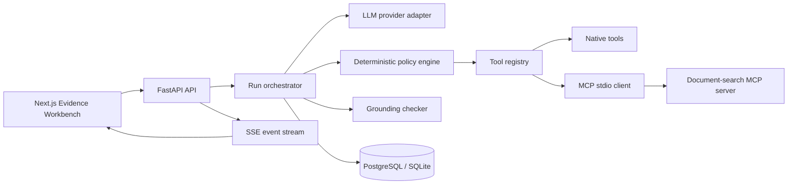

# Architecture

```mermaid
flowchart LR
  UI["Next.js Evidence Workbench"] --> API["FastAPI API"]
  API --> ORCH["Run orchestrator"]
  ORCH --> PROVIDER["LLM provider adapter"]
  ORCH --> POLICY["Deterministic policy engine"]
  POLICY --> REGISTRY["Tool registry"]
  REGISTRY --> NATIVE["Native tools"]
  REGISTRY --> MCP["MCP stdio client"]
  MCP --> DOCS["Document-search MCP server"]
  ORCH --> GROUND["Grounding checker"]
  ORCH --> DB[("PostgreSQL / SQLite")]
  API --> SSE["SSE event stream"]
  SSE --> UI
```

Every model-requested tool call crosses the policy engine before execution.
Trace events are append-only and sanitized before persistence.

